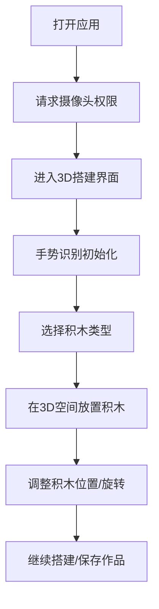

## 1. Product Overview
BlockCraft是一个通过视频识别手势来搭建3D积木的网页应用，提供类似Blender的操作界面。
- 主要目标是让用户通过摄像头手势控制来创建和编辑3D积木模型，无需传统鼠标键盘操作
- 面向创意爱好者、教育领域和休闲用户，提供直观的3D创作体验

## 2. Core Features

### 2.1 User Roles
| 角色 | 注册方式 | 核心权限 |
|------|--------|----------|
| 普通用户 | 无需注册 | 使用所有3D搭建功能，保存作品到本地 |

### 2.2 Feature Module
1. **3D搭建界面**: 主工作区、工具栏、属性面板、视频捕捉区域

### 2.3 Page Details
| 页面名称 | 模块名称 | 功能描述 |
|---------|---------|----------|
| 3D搭建界面 | 主工作区 | 显示3D场景，用户可通过手势操作来放置、移动、旋转积木 |
| 3D搭建界面 | 工具栏 | 提供积木类型选择、工具切换、视图控制等功能 |
| 3D搭建界面 | 属性面板 | 显示和调整选中积木的属性，如颜色、大小、材质等 |
| 3D搭建界面 | 视频捕捉区域 | 显示摄像头画面，实时识别用户手势 |
| 3D搭建界面 | 状态栏 | 显示当前操作状态、提示信息和系统状态 |

## 3. Core Process
用户打开应用后，系统会请求摄像头权限，获得权限后进入3D搭建界面。用户可以通过特定手势来选择积木类型、在3D空间中放置积木、调整积木位置和旋转角度。系统实时识别手势并转换为相应的3D操作。

## 4. User Interface Design
### 4.1 Design Style
- 主色调: 深蓝色 (#1a2b47) 和亮蓝色 (#3b82f6) 作为主色，搭配中性灰色 (#f3f4f6) 作为背景
- 强调色: 橙色 (#f97316) 用于突出重要控件和状态
- 按钮风格: 圆角矩形，带有微妙的阴影效果，悬停时有轻微放大动画
- 字体: 无衬线字体，主标题使用较粗字重，正文使用常规字重
- 布局风格: 模块化布局，清晰的分区，充足的内边距
- 图标风格: 简洁现代的线性图标，带有微妙的填充效果

### 4.2 Page Design Overview
| 页面名称 | 模块名称 | UI元素 |
|---------|---------|--------|
| 3D搭建界面 | 主工作区 | 占据中心位置的大型3D视图，深色背景 (#0f172a)，带有网格辅助线，支持鼠标和手势控制 |
| 3D搭建界面 | 工具栏 | 位于左侧，垂直排列的工具按钮，每个工具都有图标和文字说明，当前选中工具高亮显示 |
| 3D搭建界面 | 属性面板 | 位于右侧，可折叠，显示当前选中对象的详细属性，使用卡片式布局，输入控件采用现代风格 |
| 3D搭建界面 | 视频捕捉区域 | 位于底部右侧，小窗口显示摄像头画面，带有手势识别状态指示器 |
| 3D搭建界面 | 状态栏 | 位于顶部，显示当前操作模式、FPS、坐标信息等，使用半透明背景 |

### 4.3 Responsiveness
- 桌面优先设计，针对大屏幕优化布局
- 支持平板设备，在小屏幕上自动调整面板大小和位置
- 触摸优化，支持触摸设备上的基本操作

### 4.4 3D Scene Guidance
- 环境: 深色背景，带有柔和的环境光
- 光照: 三点光源系统，主光源+两个辅助光源，提供均匀照明
- 相机: 透视相机，支持轨道控制，默认视角从斜上方俯瞰场景
- 构图: 场景中心为主要工作区域，周围留有足够空间
- 交互: 支持平移、旋转、缩放等基本3D操作
- 后处理: 轻微的抗锯齿和 bloom 效果，提升视觉质量
- 资产: 低多边形风格的积木模型，多种颜色和形状可选