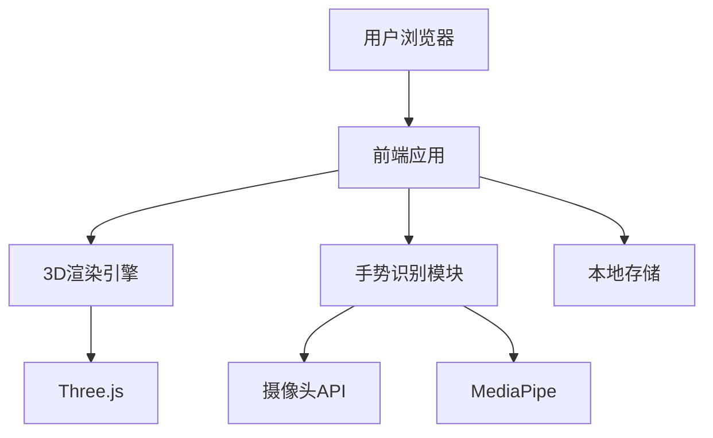
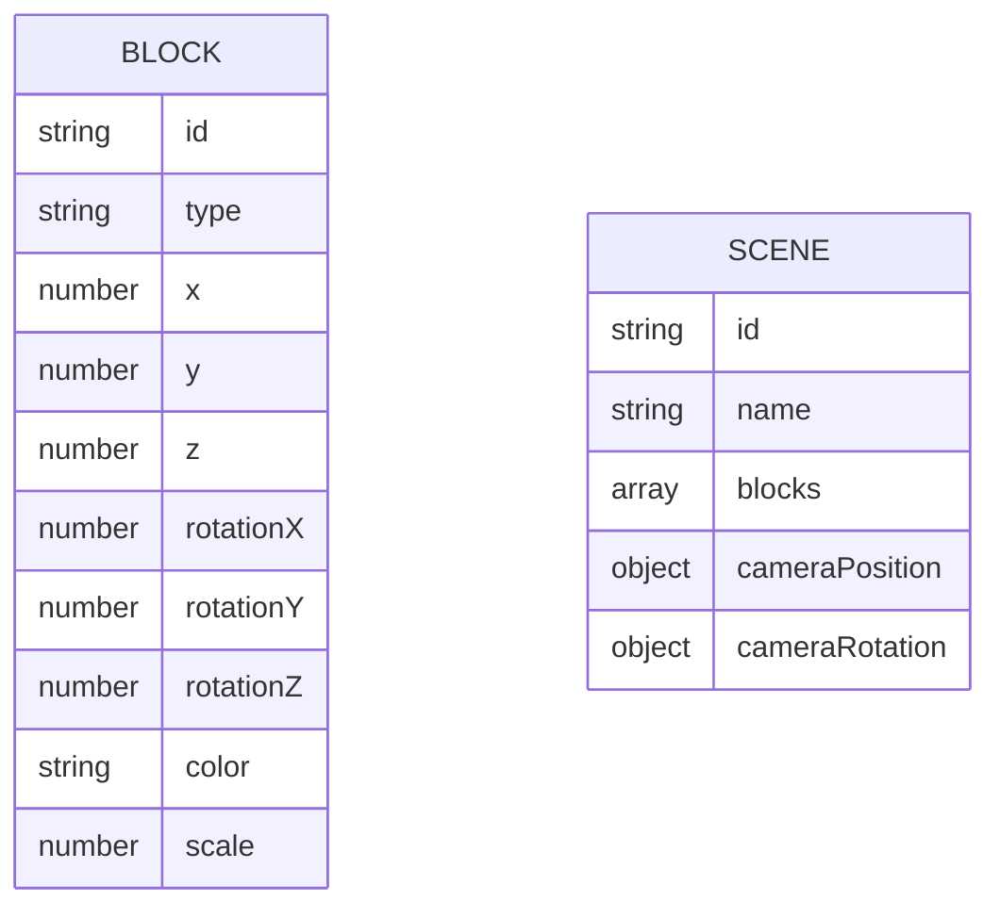

## 1. Architecture Design


## 2. Technology Description
- Frontend: React@18 + TypeScript + Tailwind CSS@3 + Vite
- 3D渲染: Three.js + @react-three/fiber + @react-three/drei
- 手势识别: MediaPipe Hands API
- 状态管理: Zustand
- 本地存储: localStorage (用于保存作品)
- 构建工具: Vite

## 3. Route Definitions
| 路由 | 用途 |
|------|------|
| / | 3D搭建界面，应用的唯一页面 |

## 4. API Definitions
无后端API，所有功能均在前端实现。

## 5. Server Architecture Diagram
无后端服务，所有逻辑均在前端执行。

## 6. Data Model
### 6.1 Data Model Definition


### 6.2 Data Definition Language
无数据库，数据存储在本地localStorage中，结构如下：

```javascript
// 场景数据结构
interface Block {
  id: string;
  type: string; // 'cube', 'sphere', 'cylinder'等
  position: { x: number; y: number; z: number };
  rotation: { x: number; y: number; z: number };
  scale: { x: number; y: number; z: number };
  color: string; // 十六进制颜色值
  material: string; // 'standard', 'phong'等
}

interface Scene {
  id: string;
  name: string;
  blocks: Block[];
  cameraPosition: { x: number; y: number; z: number };
  cameraRotation: { x: number; y: number; z: number };
  createdAt: number;
  updatedAt: number;
}
```